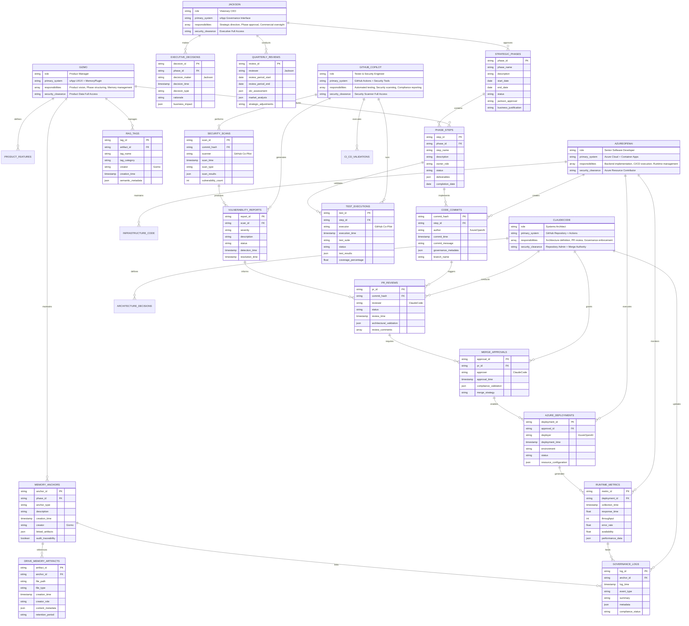
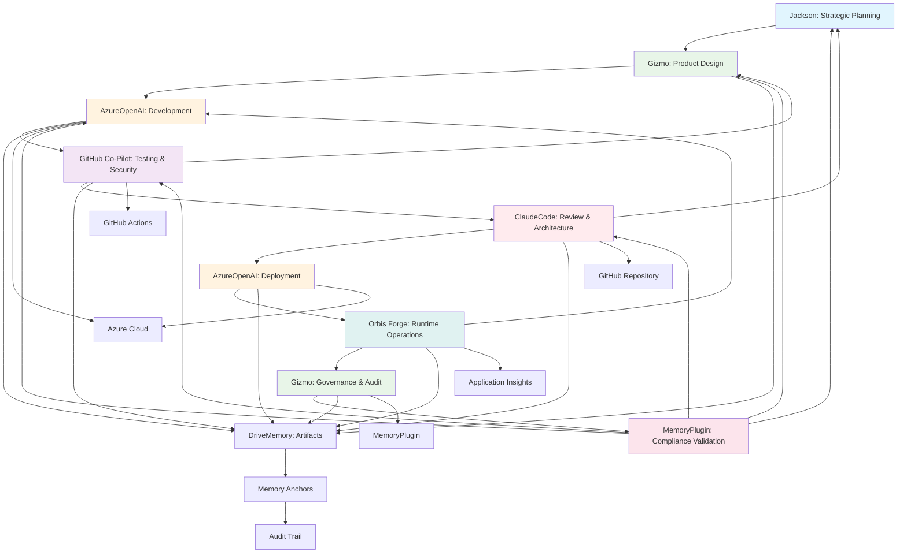
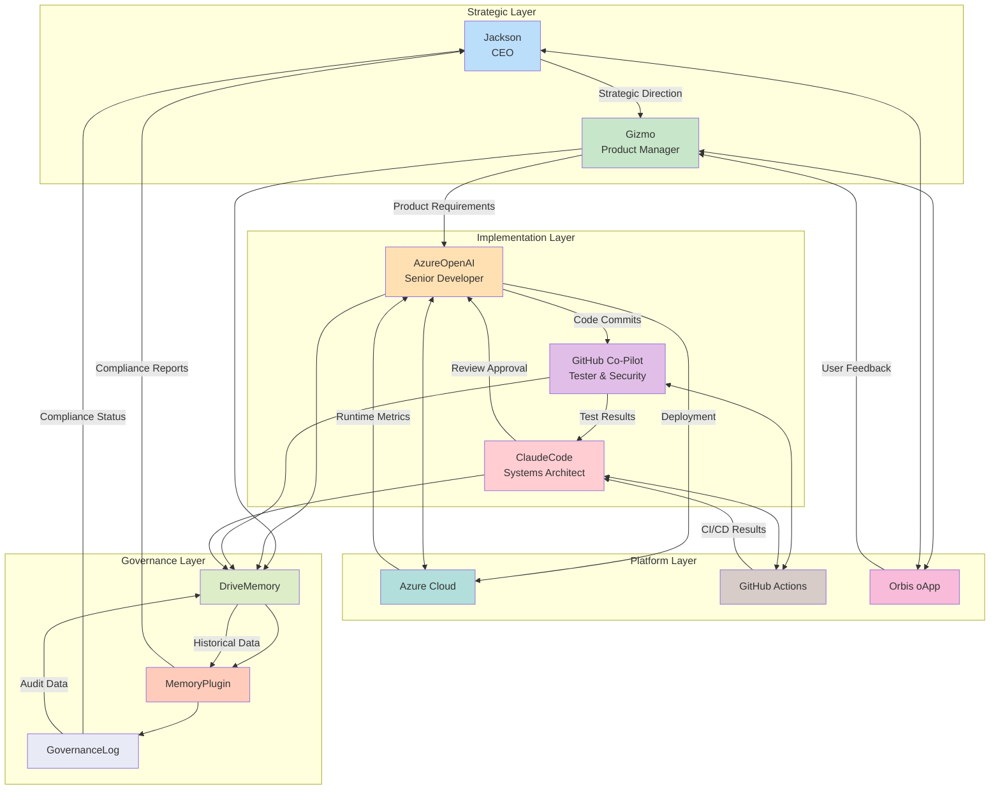
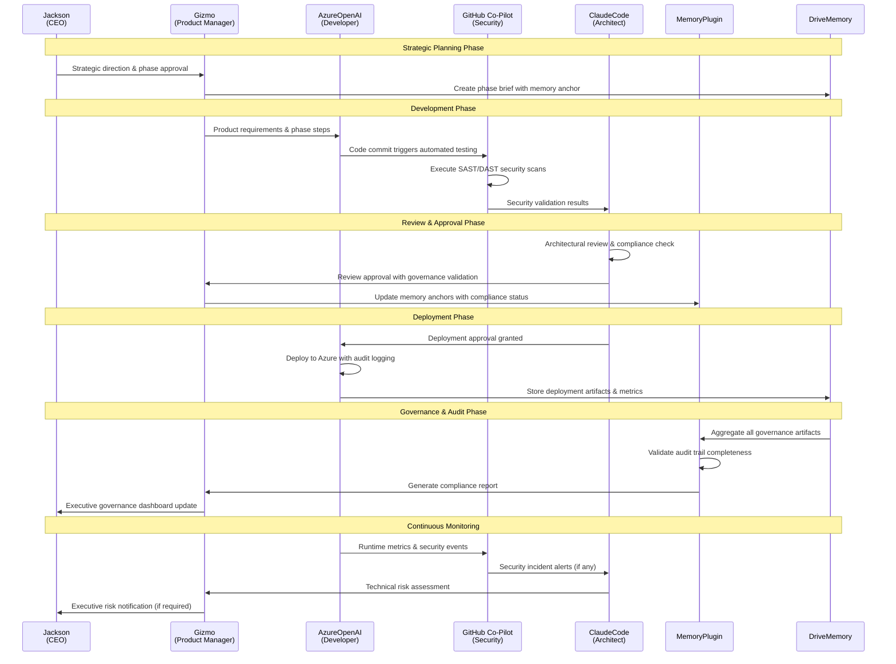
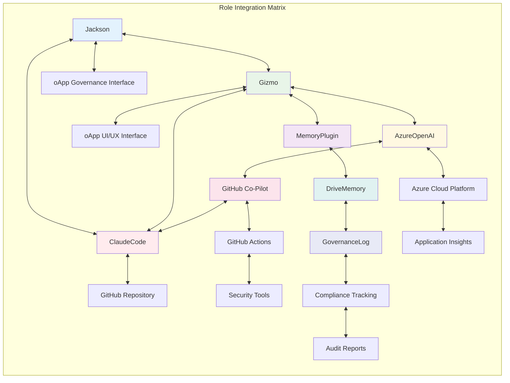
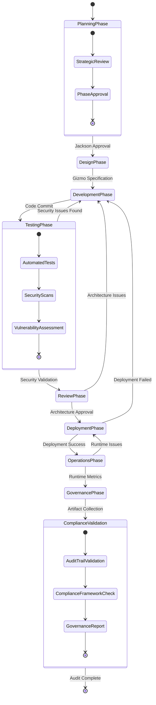
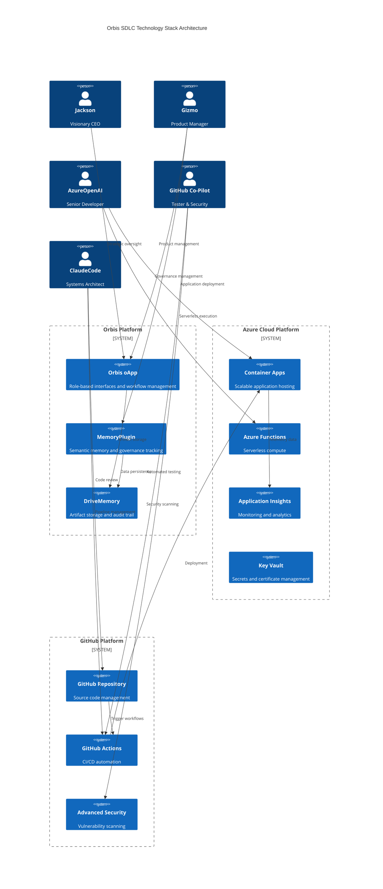

# 🏗️ Orbis SDLC Architecture - Mermaid ERD & Flow Diagrams

**Architecture:** Azure + GitHub Hybrid Cloud-Native SDLC  
**Framework:** Role-Based Orchestration with DriveMemory + MemoryPlugin Integration  
**Version:** 2025.1.0  
**Memory Anchor:** orbis-role-model-2025

---

## 1️⃣ Entity Relationship Diagram (ERD)

---

## 2️⃣ SDLC Workflow Diagram

---

## 3️⃣ Data Flow Architecture

---

## 4️⃣ Security & Compliance Flow

---

## 5️⃣ Integration Points Matrix

---

## 6️⃣ Compliance Validation Flow

---

## 7️⃣ Technology Stack Architecture

---

**Architecture Authority:** ClaudeCode (Systems Architect) + Jackson (CEO)  
**Technical Review:** AzureOpenAI (Senior Developer) + GitHub Co-Pilot (Security Engineer)  
**Product Alignment:** Gizmo (Product Manager)  
**Memory Anchor:** orbis-role-model-2025  
**Last Updated:** 2025-08-06