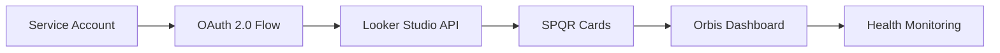

# SPQR Phase 6 Planning Seed

**Phase Title:** Secure Automation & Orbis Dashboard Integration  
**Planning Date:** 2025-07-30  
**Status:** 🌱 PLANNING INITIATED  
**Previous Phase:** Phase5–LiveRuntimeSurface ✅ COMPLETE

## Phase 6 Objectives

### 🔐 Primary Objective: Secure Automation & Integration
Transform the SPQR platform from manual embedded access to secure, automated dashboard integration with enhanced observability and continuous semantic auditing.

### 🎯 Core Objectives

#### 1. Convert Gmail/Puppeteer Automation to OAuth/Service Account
- **Current State:** Manual SPQR card embedding via Gmail/Puppeteer scripts
- **Target State:** OAuth-based service account authentication for Looker Studio
- **Business Value:** Enhanced security, automated refresh, reduced manual intervention
- **Technical Scope:**
  - Replace Puppeteer Gmail automation with OAuth 2.0 flow
  - Implement service account authentication for Looker Studio API
  - Create secure token management and refresh mechanisms
  - Maintain backward compatibility with existing embed URLs

#### 2. Integrate SPQR Dashboards into Orbis Dashboard Health Panel
- **Current State:** SPQR dashboards accessible via separate runtime page
- **Target State:** Native integration into Orbis Dashboard with health monitoring
- **Business Value:** Unified dashboard experience, real-time health monitoring
- **Technical Scope:**
  - Embed SPQR dashboard widgets into Orbis Dashboard health panel
  - Create unified health status indicators across all analytics
  - Implement cross-platform RAG scoring and alerting
  - Ensure seamless user experience across all dashboard components

#### 3. Enable Continuous Semantic Audit with MemoryPlugin + RAG
- **Current State:** Manual UAT and governance logging
- **Target State:** Automated semantic analysis and continuous audit capabilities
- **Business Value:** Proactive issue detection, automated quality assurance
- **Technical Scope:**
  - Integrate MemoryPlugin for continuous semantic analysis
  - Implement RAG-based audit workflows for dashboard content
  - Create automated anomaly detection for data quality
  - Enable predictive analytics for system health and performance

## 📋 Phase 5 Context & Foundation

### ✅ Completed Phase 5 Deliverables
- **Live Runtime Surface:** Fully operational SPQR runtime page in Orbis Forge
- **21 SPQR Cards:** All analytics cards with role-based access control
- **Governance Framework:** Complete audit trail and observability system
- **UAT Infrastructure:** Comprehensive testing and sign-off protocols
- **Production Deployment:** v5.0-SPQR-Runtime successfully deployed

### 🏗️ Infrastructure Foundation Available
- **Authentication System:** Role-based access (Partner/Senior Manager/Associate/Paralegal/Admin)
- **Alert Infrastructure:** Slack/Email/Webhook integration ready
- **Memory System:** MemoryPlugin anchors and classification established
- **Development Environment:** oApp integration with 92 projects visible
- **Governance Logging:** Real-time tracking and audit capabilities

## 🛠️ Technical Architecture Planning

### OAuth/Service Account Implementation


### Integration Architecture
```
Phase 6 Components:
├── Authentication Service
│   ├── OAuth 2.0 Implementation
│   ├── Service Account Management
│   └── Token Refresh Automation
├── Dashboard Integration
│   ├── Orbis Health Panel Widgets
│   ├── Unified RAG Scoring
│   └── Cross-platform Alerts
└── Semantic Audit Engine
    ├── MemoryPlugin Integration
    ├── RAG-based Analysis
    └── Automated Quality Assurance
```

## 📊 Success Criteria

### Phase 6 Completion Criteria
- [ ] **OAuth Authentication:** Service account replacing Gmail/Puppeteer automation
- [ ] **Dashboard Integration:** SPQR widgets native in Orbis health panel
- [ ] **Semantic Auditing:** Continuous RAG-based quality monitoring active
- [ ] **Security Hardening:** All authentication upgraded to enterprise standards
- [ ] **Performance Optimization:** Sub-second load times for all integrated components
- [ ] **Unified Observability:** Single health dashboard for all SPQR + Orbis systems

### Business Impact Targets
- **Security Posture:** 100% OAuth-based authentication (eliminate manual processes)
- **User Experience:** Single dashboard for all analytics and health monitoring
- **Operational Efficiency:** Automated quality assurance and anomaly detection
- **Risk Reduction:** Proactive issue detection and automated alert escalation

## 🔗 Phase 5 Artefact Links

### Production Code References
- **Runtime Dashboard:** `src/components/SPQR/SPQRRuntimeDashboard.tsx`
- **Runtime Page:** `src/pages/SPQR/Runtime.tsx`
- **Governance Logger:** `src/services/governance-logger.ts`
- **Enhanced Sidebar:** `src/components/layout/EnhancedProjectSidebar.tsx`

### Documentation & UAT Materials
- **Archive Summary:** `DriveMemory/SPQR/Phase5/SPQR-Phase5-ArchiveSummary.md`
- **Card Embeds:** `DriveMemory/SPQR/Phase5/SPQR_Card_Embeds.csv` (21 cards)
- **UAT Template:** `DriveMemory/SPQR/UAT/SPQR_Phase5_UAT_Report_Template.md`
- **Completion Report:** `SPQR_DEPLOYMENT_PHASE_COMPLETE.md`

### Governance & Memory Anchors
- **MemoryPlugin Anchors:** 
  - `SPQR-Phase5-Complete`
  - `SPQR-Phase5-ArchiveSummary`
- **Governance Entries:** Lines 12-35, 37, 43-49 in `logs/governance.jsonl`
- **Production Tag:** `v5.0-SPQR-Runtime`

## 🚀 Phase 6 Roadmap Overview

### Sprint 1: Security Foundation (OAuth Implementation)
- OAuth 2.0 service account setup
- Replace Puppeteer automation
- Secure token management
- Authentication testing

### Sprint 2: Dashboard Integration (Orbis Health Panel)
- SPQR widget integration into Orbis Dashboard
- Unified health monitoring
- Cross-platform RAG scoring
- User experience optimization

### Sprint 3: Semantic Audit Engine (MemoryPlugin + RAG)
- MemoryPlugin integration for continuous analysis
- RAG-based audit workflows
- Automated anomaly detection
- Predictive analytics implementation

### Sprint 4: Production Hardening & Go-Live
- Performance optimization
- Security audit and penetration testing
- Production deployment and monitoring
- Phase 6 completion and archival

## 📋 Resource Requirements

### Technical Dependencies
- **Looker Studio API Access:** OAuth 2.0 service account credentials
- **MemoryPlugin Integration:** RAG analysis capabilities
- **Orbis Dashboard Modification:** Health panel integration points
- **Authentication Infrastructure:** Enterprise OAuth implementation

### Team Coordination
- **Security Team:** OAuth implementation and audit
- **Platform Team:** Orbis Dashboard integration
- **AI/ML Team:** MemoryPlugin and RAG implementation
- **QA Team:** Comprehensive testing and validation

## 🎯 Next Steps

### Immediate Actions (Week 1)
1. **Technical Discovery:** Audit current Gmail/Puppeteer automation
2. **OAuth Planning:** Research Looker Studio service account requirements
3. **Integration Analysis:** Map Orbis Dashboard health panel integration points
4. **Resource Allocation:** Assign team members and define sprint structure

### Phase 6 Kickoff Prerequisites
- [ ] Phase 5 formal sign-off and UAT completion
- [ ] OAuth service account credentials obtained
- [ ] MemoryPlugin RAG capabilities confirmed
- [ ] Orbis Dashboard integration architecture approved

---

**Planning Initiated By:** Claude  
**Phase Status:** 🌱 Planning Seed Created  
**Foundation Phase:** Phase5–LiveRuntimeSurface ✅ Complete  
**Next Phase Target:** Q1 2025 OAuth + Integration Delivery