# Wombat Track (WT) App - Updated UML Class Diagram

```mermaid
classDiagram
    %% PLAN SURFACE (Blue)
    class Project {
        +string id
        +string title
        +string description
        +string goals
        +string scopeNotes
        +List~string~ keyTasks
        +List~string~ aiPromptLog
    }

    class Phase {
        +string id
        +string projectId
        +string title
        +string description
        +string status
        +string startDate
        +string endDate
        +number completionPercent
        +string ragStatus
        +string ownerId
        +List~string~ tags
        +string createdAt
        +string updatedAt
    }

    class PhaseStep {
        +string id
        +number stepNumber
        +string stepInstruction
        +boolean isSideQuest
        +List~string~ aiSuggestedTemplates
    }

    %% EXECUTE SURFACE (Yellow)
    class StepProgress {
        +string id
        +string status
        +string notes
        +string assignedTo
        +string updatedOn
        +string blockerNotes
    }

    %% GOVERN SURFACE (Green)
    class GovernanceLog {
        +string id
        +string entryType
        +string summary
        +string gptDraftEntry
        +string createdBy
    }

    class CheckpointReview {
        +string id
        +string status
        +string aiRiskSummary
    }

    class MeetingLog {
        +string id
        +string summary
        +List~string~ decisionsMade
        +string gptDraftEntry
    }

    %% INTEGRATE SURFACE (Grey)
    class Agent {
        +string id
        +string name
        +string description
        +string icon
        +List~string~ capabilities
        +string currentStatus
        +string version
        +string endpoint
        +string createdAt
        +string lastActiveAt
        +boolean isLive
        +string dispatchMode
    }

    class ExternalService {
        +string id
        +string name
        +string type
        +string status
        +string docURL
        +string healthEndpoint
        +string version
        +string provider
        +string region
        +List~string~ dependencies
        +string createdAt
        +string lastStatusUpdate
        +string apiEndpoint
    }

    class DispatchLog {
        +string id
        +string timestamp
        +string prompt
        +string response
        +boolean isSuccess
        +string promptType
        +string projectId
        +string phaseStepId
        +string userId
        +string agentVersion
        +number responseTime
        +number tokensUsed
    }

    class IntegrationCard {
        +string name
        +string status
        +string lastChecked
        +boolean isActive
        +string category
        +string logURL
    }

    %% INTELLIGENCE SURFACE (Purple)
    class Template {
        +string id
        +string templateName
        +string usageType
        +string status
    }

    class MemoryAnchor {
        +string id
        +string sourceType
        +List~string~ tags
        +string timestamp
        +string content
        +string contextData
    }

    %% RELATIONSHIPS
    %% Plan Surface
    Project "1" --> "*" PhaseStep : has
    Project "1" --> "*" Phase : has
    Phase "1" --> "*" PhaseStep : contains
    
    %% Execute Surface
    PhaseStep "1" --> "1" StepProgress : has
    
    %% Govern Surface
    PhaseStep "1" --> "*" GovernanceLog : has
    PhaseStep "1" --> "*" CheckpointReview : has
    PhaseStep "1" --> "*" MeetingLog : has
    GovernanceLog "1" --> "0..1" MeetingLog : related
    
    %% Integrate Surface
    Agent "1" --> "*" DispatchLog : generates
    Agent "*" --> "*" ExternalService : uses
    ExternalService "1" --> "*" DispatchLog : processes
    
    %% Cross-Surface Relationships
    Project "1" --> "*" DispatchLog : linked
    Project "1" --> "*" IntegrationCard : linked
    Project "1" --> "*" MemoryAnchor : linked
    PhaseStep "1" --> "*" DispatchLog : linked
    PhaseStep "*" --> "*" Template : references
    PhaseStep "1" --> "*" MemoryAnchor : linked
    GovernanceLog "1" --> "*" DispatchLog : triggers
    GovernanceLog "1" --> "*" MemoryAnchor : linked

    %% STYLING
    classDef planSurface fill:#e1f5fe,stroke:#01579b,stroke-width:2px
    classDef planProposed fill:#bbdefb,stroke:#1565c0,stroke-width:3px,stroke-dasharray: 5 5
    classDef executeSurface fill:#fff8e1,stroke:#e65100,stroke-width:2px
    classDef governSurface fill:#e8f5e8,stroke:#2e7d32,stroke-width:2px
    classDef integrateSurface fill:#f3e5f5,stroke:#4a148c,stroke-width:2px
    classDef intelligenceSurface fill:#fce4ec,stroke:#880e4f,stroke-width:2px

    %% Plan Surface (Blue)
    class Project planSurface
    class Phase planProposed
    class PhaseStep planSurface
    
    %% Execute Surface (Yellow)
    class StepProgress executeSurface
    
    %% Govern Surface (Green)
    class GovernanceLog governSurface
    class CheckpointReview governSurface
    class MeetingLog governSurface
    
    %% Integrate Surface (Grey)
    class Agent integrateSurface
    class ExternalService integrateSurface
    class DispatchLog integrateSurface
    class IntegrationCard integrateSurface
    
    %% Intelligence Surface (Purple)
    class Template intelligenceSurface
    class MemoryAnchor intelligenceSurface
```

## Updated Architecture Summary

### 🔷 PLAN SURFACE (Blue)
- **Project**: Root entity with direct relationships to PhaseStep, DispatchLog, IntegrationCard, MemoryAnchor
- **🔵 Phase (Proposed)**: Future hierarchical organization layer with project ownership, RAG status tracking, and completion metrics
- **PhaseStep**: Core planning unit with relationships across all surfaces

### 🟡 EXECUTE SURFACE (Yellow)  
- **StepProgress**: 1:1 execution tracking for each PhaseStep with status and blocker management

### 🟩 GOVERN SURFACE (Green)
- **GovernanceLog**: Decision and change tracking with AI draft capabilities
- **CheckpointReview**: Risk assessment and approval gates
- **MeetingLog**: Meeting summaries with decision capture

### 🔗 INTEGRATE SURFACE (Grey)
- **Agent**: AI agents (Claude, Gizmo) with capability tracking and dispatch coordination
- **ExternalService**: Third-party service integration with health monitoring
- **DispatchLog**: AI interaction audit trail with performance metrics
- **IntegrationCard**: Service health dashboard components

### 🧠 INTELLIGENCE SURFACE (Purple)
- **Template**: Reusable AI prompt and workflow templates
- **MemoryAnchor**: Context preservation and cross-reference system

## Key Changes from Previous Version

1. **Enhanced Phase Entity**: Now includes comprehensive project management fields (RAG status, completion tracking, ownership)
2. **Updated Relationships**: Phase now properly sits between Project and PhaseStep in the hierarchy
3. **Visual Distinction**: Phase entity uses dashed border styling to indicate "proposed/not yet implemented" status
4. **Complete Field Mapping**: All entities now include the full field specifications from Gizmo's requirements